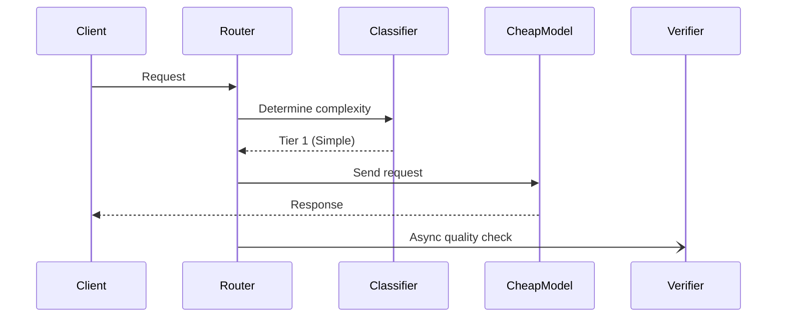

# Architecture: LLM Cost Autopilot

## System Diagram
The following Mermaid.js sequence diagram maps the core workflow and interactions:

## Component Breakdown
- **Core Technology**: TypeScript, Express, OpenAI, Anthropic, Ollama
- **Design Paradigm**: Emphasizes high availability, fault tolerance, and security.
