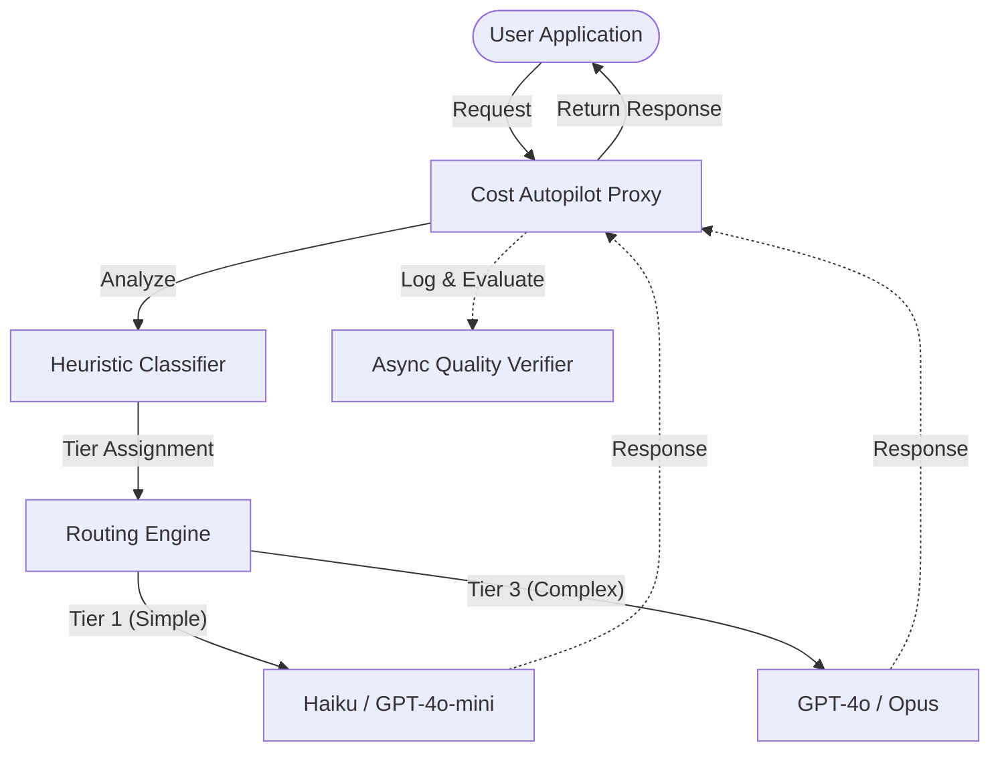

# Architecture — llm-cost-autopilot
> Last updated: 2026-08-29 | Maturity: Full Prototype
> _LLM routing proxy for cost optimization._

## System Diagram
The following Mermaid.js sequence diagram maps the core workflow and interactions:

## Component Table

| Component | File | Responsibility | Tech |
|---|---|---|---|
| API Server | `src/server.ts` | Express server intercepting API calls | Node.js |
| Classifier | `src/classifier.ts` | Determines query complexity heuristically | TypeScript |
| Router | `src/router.ts` | Dispatches to appropriate upstream model | TypeScript |
| Database | `src/db.ts` | SQLite for logging metrics and savings | SQLite |

## Port Assignments

| Service | Port | Notes |
|---|---|---|
| Proxy API | `3000` | Local proxy endpoint |

## Dependency Honesty Table

| Dependency | Status | Notes |
|---|---|---|
| Upstream LLMs | **Optional** | Requires API keys for full capability; tests use mocks. |
| SQLite | **Real** | Used for local, fast logging. |

## Component Breakdown
- **Core Technology**: TypeScript, Express, OpenAI, Anthropic, Ollama
- **Design Paradigm**: Emphasizes high availability, fault tolerance, and security.